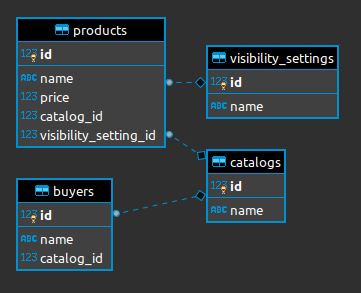

# Problem 1

Solution developed in Python 3, making it possible to obtain the execution time of several Python codes in just one instruction:

`python3 -m timer.run [code_1.py] [Python version] [code_2.py] [Python version] [...]`

The argument `[Python version]` specifies the version of Python used by the respective code, being either `2` or` 3`, preventing any code from being executed by only one of the two versions, an action that could cause possible incompatibilities.

### Example:

- `cd problem_1`

- `python3 -m timer.run sample_code_1.py 3 sample_code_2.py 3`

- Output:

    ```
    sample_code_1.py 0:00:01 

    sample_code_2.py 0:00:02
    ```

# Problem 2

Solution developed using Postgres 12.

### Question A

Contains tables and relationships.



### Question B

Query based on `data_load.sql`, which returns products from the catalog that the buyer is part of and products from other catalogs that have` default` visibility.

Output:

| buyer | product       | price      | catalog_id | visibility_setting_id |
| :-----|:--------------| :----------|:-----------|:----------------------|
| James | Lamborghini   | 2000000.00 |1           |2                      |
| James | Ferrari       | 1000000.00 |1           |2                      |
| James | BMW           |  600000.00 |1           |1                      |
| James | Porsche       |  500000.00 |1           |1                      |
| James | Mercedez Benz |  300000.00 |1           |1                      |
| James | Honda         |   30000.00 |2           |1                      |
| James | Yamaha        |   25000.00 |2           |1                      |